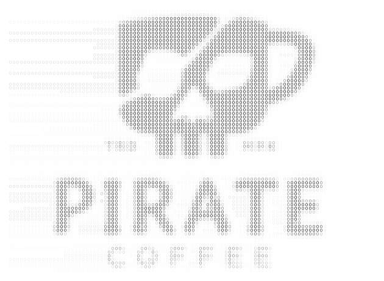

# Pirate cafe



Pirate cafe will automatically download the recent torrents and become a seeder for [https://thepiratebay.org/](https://thepiratebay.org/).

```sh
# Build
$ ./cmd/develop.sh

# Usage
$ ./bin/pirate-cafe
# By default, pirate-cafe use up to 8G disk for data storage at path "./pirate".
```

This project aims to contribute idle bandwidth and disk space on the server, before using this project, please confirm whether BT is legal in your area.
